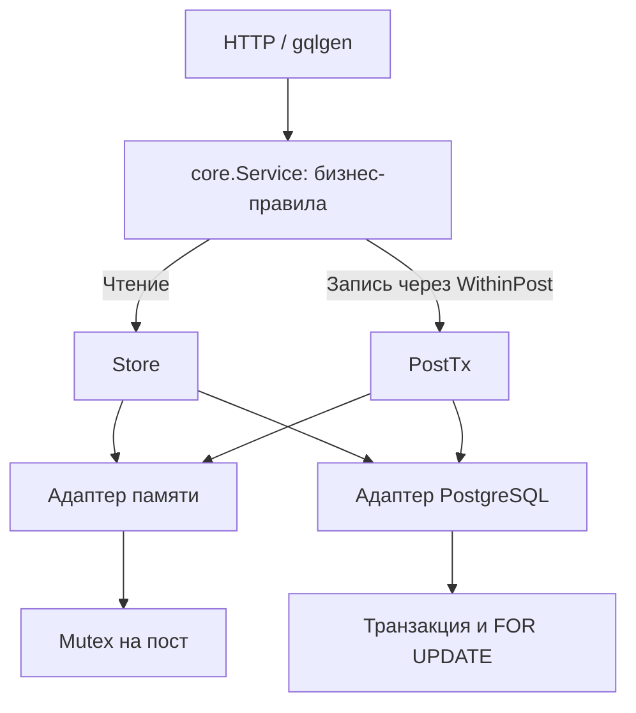
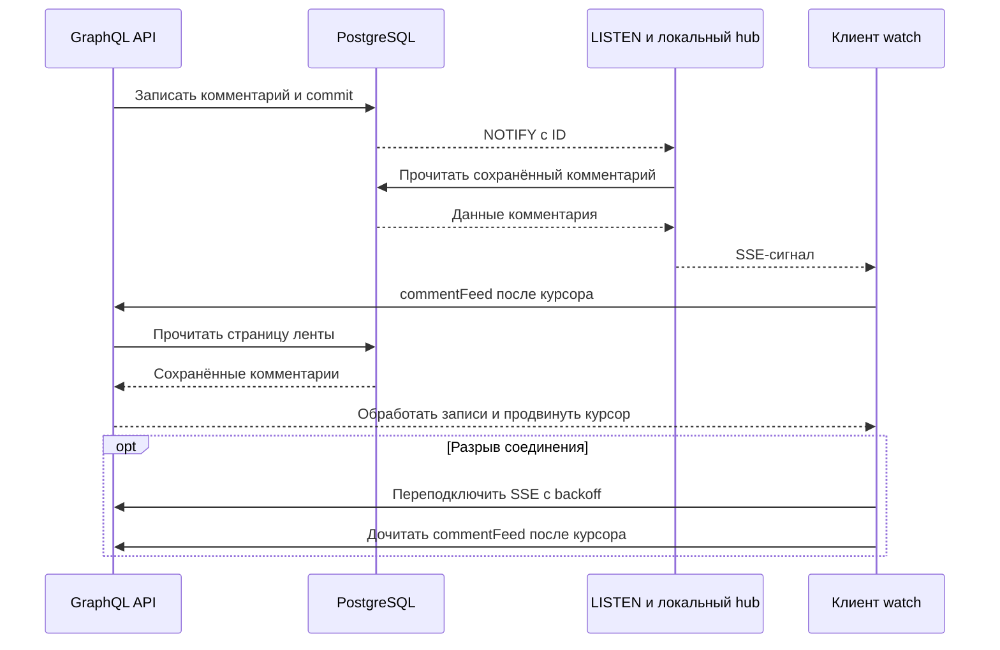

# Ozon Go · посты и комментарии

[](https://github.com/maxmashevsky-bit/ozon/actions/workflows/verify.yml)

GraphQL-сервис на Go для публикации постов и обсуждений с древовидными комментариями. Реализация [тестового задания Ozon](Техническое%20задание%20Озон.docx): два хранилища, курсорная пагинация, управление обсуждением и подписки на новые комментарии.

В основе — модульный монолит. Бизнес-правила одинаковы для памяти и PostgreSQL; корректность при конкурентных запросах проверяется общими контрактными тестами. Для проверки проекта подготовлены Docker-стенд, демонстрационные данные и автоматизированные сценарии отказов.

**[Запуск](#быстрый-запуск) · [API](#graphql-api) · [Архитектура](#архитектура) · [Проверки](#проверки) · [Нагрузка](#нагрузка-и-масштабирование)**

## Что стоит посмотреть

- **Конкурентное закрытие обсуждения.** Добавление комментария и изменение разрешения используют одну блокировку поста. Закрытое обсуждение запрещает и новые корни, и ответы.
- **Предсказуемое чтение дерева.** Загружается страница непосредственных детей; курсор привязан к конкретному списку. Для раскрытия нескольких веток есть пакетная операция с фиксированным числом SQL-запросов.
- **Восстановление подписки.** SSE сообщает о новых данных, а сохранённая лента позволяет дочитать пропущенные комментарии после разрыва соединения.
- **Проверяемые решения.** В репозитории есть тесты гонок, воспроизводимая генерация, планы SQL и отчёты нагрузки с параметрами запусков.

## Быстрый запуск

### PostgreSQL и Docker

Нужны **Docker Engine/Desktop, Docker Compose v2, Make и Python 3.10+**. Go для этого способа собирается внутри Docker. Python-скрипты используют стандартную библиотеку.

```sh
git clone https://github.com/maxmashevsky-bit/ozon.git
cd ozon
make up
make seed
```

`make up` собирает образ, запускает PostgreSQL, отдельный мигратор, приложение и Nginx, ждёт готовности и выдаёт локальные JWT. `make seed` создаёт **3 поста, 9 корневых комментариев и 9 ответов**. Повторный запуск сверяет данные с API и продолжает прерванное заполнение без дубликатов.

| Адрес | Назначение |
|---|---|
| [localhost:8080](http://localhost:8080) | GraphQL Playground |
| [localhost:8080/query](http://localhost:8080/query) | GraphQL endpoint, HTTP POST |
| [localhost:8080/readyz](http://localhost:8080/readyz) | Готовность к работе: 204 или 503 |
| [localhost:18081/metrics](http://localhost:18081/metrics) | Метрики первой реплики |

Посты можно сразу посмотреть публичным запросом:

```sh
curl -s http://localhost:8080/query \
  -H 'Content-Type: application/json' \
  --data '{"query":"{ posts(first: 3) { edges { node { id title commentsAllowed } } } }"}'
```

Все команды выполняются из корня репозитория. Порты опубликованы на `127.0.0.1`; PostgreSQL по умолчанию доступен на 5432, прямые порты приложений — 18081–18083.

### В памяти, без Docker

Для локального Go-запуска нужны **Go, Make и Python 3.10+**. Makefile закрепляет toolchain **Go 1.25.0** через `GOTOOLCHAIN`.

```sh
make run
```

Сервис использует тот же GraphQL API и JWT. Данные хранятся в одном процессе и исчезают после его остановки. Режимы памяти и Docker по умолчанию занимают один порт 8080; выберите один из них.

### Управление стендом

| Команда | Результат |
|---|---|
| `make up-scale` | Три приложения за Nginx, существующие данные PostgreSQL сохраняются |
| `make down` | Остановка стенда с сохранением volume |
| `make seed` | Создание или восстановление демонстрационного набора |
| `make clean-seed` | Очистка своего seed-набора; чужие комментарии останавливают удаление |

Секреты, токены и прогресс seed находятся в `.local/`, исключённой из Git и Docker build context. **Сохраняйте `.local/` вместе с постоянным volume:** там находятся его учётные данные. Очистка seed блокирует посты, проверяет принадлежность данных и удаляет их в одной транзакции; при ошибке manifest сохраняется.

## GraphQL API

Чтения и подписки публичны. Для mutations нужен `Authorization: Bearer <JWT>`. Автор определяется по проверенному `sub`; в обычном режиме `X-User-ID` игнорируется.

После Docker-запуска токены `alice`, `bob`, `demo` и `bench` доступны в `.local/*.token`. Создание поста от имени Alice:

```sh
curl -s http://localhost:8080/query \
  -H 'Content-Type: application/json' \
  -H "Authorization: Bearer $(cat .local/alice.token)" \
  --data '{"query":"mutation { createPost(title: \"Первый пост\", text: \"Обсуждаем Go\") { id authorId commentsAllowed } }"}'
```

В Playground задайте тот же заголовок `Authorization`. Для режима памяти токен можно выпустить во втором терминале:

```sh
make tools
bin/token -key-file .local/jwt.key -user alice -ttl 1h > .local/alice.token
```

| Операция | Назначение |
|---|---|
| `createPost` / `post` / `posts` | Создание, чтение поста и страницы постов |
| `addComment` / `comment` | Добавление и чтение комментария |
| `comments` | Страница корней или непосредственных ответов |
| `setCommentsAllowed` | Закрытие или открытие обсуждения автором поста |
| `commentBranches` | Пакетная загрузка страниц нескольких веток |
| `commentAdded` | Подписка на новые комментарии поста через SSE |
| `commentFeed` | Сохранённая лента всех комментариев поста для восстановления |

Полный контракт: [schema.graphqls](internal/graph/schema.graphqls).

```graphql
mutation AddComment($post: ID!, $parent: ID, $text: String!) {
  addComment(postId: $post, parentId: $parent, text: $text) {
    id
    parentId
    authorId
  }
}
```

Чтение страницы корней или ответов:

```graphql
query Comments($post: ID!, $parent: ID, $after: String) {
  comments(postId: $post, parentId: $parent, first: 20, after: $after) {
    edges {
      cursor
      node { id parentId text }
    }
    pageInfo { hasNextPage endCursor }
  }
}
```

Закрытие обсуждения автором:

```graphql
mutation CloseDiscussion($post: ID!) {
  setCommentsAllowed(postId: $post, allowed: false) {
    id
    commentsAllowed
  }
}
```

В переменную `$post` передайте реальный ID поста из ответа API. `$parent = null` означает корневой комментарий; ID существующего комментария означает ответ. Для следующей страницы передайте `endCursor` в `$after`. Сервис принимает одну операцию на документ: копируйте каждый пример отдельно.

**Границы контракта:**

- `first`: 1–100, по умолчанию 20. Курсор привязан к типу списка, посту и родителю; курсор чужого списка отвергается.
- Комментарий: до **2000 Unicode-кодовых точек**. Пустой/пробельный текст, NUL и некорректный UTF-8 запрещены. Заголовок поста — до 200, текст поста — до 100000 кодовых точек.
- Глубина хранения дерева не ограничена приложением. API возвращает страницы детей, поэтому чтение не требует загрузки всего дерева. Глубина GraphQL-документа ограничивается отдельно.
- `commentBranches`: до 20 родителей, до 100 элементов на ветку и до 500 суммарно. Порядок результатов соответствует входу; у каждой ветки независимый курсор.
- Закрытие обсуждения сохраняет доступ к уже записанным комментариям.

## Архитектура



`Service` проверяет авторство, текст, принадлежность родителя и область курсора. Адаптеры обеспечивают атомарность и доступ к данным. Оба хранилища проходят один набор контрактных тестов.

| Решение | Причина |
|---|---|
| Adjacency list: `parent_id` у комментария | Ответы любой глубины и простое чтение непосредственных детей |
| Keyset-пагинация: `id > after`, `LIMIT first+1` | Страницы без OFFSET и привязка курсора к конкретному списку |
| Одна блокировка поста для добавления и закрытия | Атомарный запрет новых комментариев и порядок commit внутри поста |
| Пакетные ветки через LATERAL | 3 SELECT для 1–20 веток вместо 60 SELECT при 20 отдельных запросах |
| Отдельный мигратор с advisory lock | Безопасный конкурентный запуск, включая создание таблицы версий Goose |
| Ограниченные буферы, пулы и операции | Контролируемое потребление ресурсов и явные ответы при перегрузке |

Курсорная пагинация не создаёт snapshot между страницами. При записи через API порядок выдачи ID внутри поста согласован с порядком commit; создание постов также сериализуется перед выдачей ID. Откаты оставляют допустимые пробелы. Сторонние SQL-вставки, обходящие блокировки, этот контракт не поддерживают.

Цена блокировки — сериализация записей в один горячий пост. Разные посты работают параллельно. [Подробное обоснование компромиссов](docs/decisions.md).

**Стек:** Go, gqlgen, PostgreSQL 17, pgx/v5, sqlc, Goose, golang-jwt/v5, Docker Compose и Nginx. Сервис, мигратор, утилиты токенов, клиент подписок и генератор нагрузки написаны на Go. Python автоматизирует подготовку стенда и запуск проверок.

## Подписки и восстановление

`commentAdded` использует HTTP POST с `Accept: text/event-stream`. Поток содержит события `next`/`complete`, сигнал регистрации `: ready` и heartbeat. PostgreSQL доставляет уведомление после commit; каждый процесс имеет отдельное LISTEN-соединение.



**SSE работает по best-effort контракту.** NOTIFY не хранит историю. После разрыва данные восстанавливаются из `commentFeed`; готовый Go-клиент использует события и heartbeat как сигналы перечитать ленту. Курсор продвигается после успешной обработки записи и хранится в памяти клиента.

```sh
make tools
POST_ID=$(python3 -c 'import json; print(json.load(open(".local/seed.json"))["posts"]["0"])')
bin/watch -url http://localhost:8080 -post "$POST_ID" \
  -token-file .local/demo.token -duration 10m
```

Команда использует ID, сохранённый `make seed`. После перезапуска самого клиента обход начинается заново; для внешних побочных эффектов нужен постоянный checkpoint и идемпотентный обработчик. Mutations автоматически не повторяются.

Медленный подписчик отключается при переполнении своего буфера. При потере LISTEN существующие потоки закрываются, а слушатель переподключается. SSE сериализуется в самостоятельные байты до следующего вызова gqlgen и записывается одной горутиной с write deadline; [регрессионный тест](internal/stream/sse_test.go) проверяет сохранность событий при задержке записи. Nginx отключает буферизацию и повтор POST на другом upstream.

## Проверки

```sh
make verify
make verify-full
```

Первая команда проверяет форматирование, `go vet`, Go-тесты с `-race`, Python-тесты и воспроизводимость генерации sqlc/gqlgen. Вторая дополнительно собирает Docker-образ и проверяет PostgreSQL и три приложения за Nginx на отдельном стенде.

| Группа | Что проверяется |
|---|---|
| Контракт memory/PostgreSQL | Посты, дерево, Unicode, страницы, область курсора, авторство |
| Конкурентность | Закрытие против добавления, отмена на блокировке, порядок commit и ID |
| Подписки | Межсерверная доставка, heartbeat, медленный потребитель, сохранность ответа SSE |
| Восстановление | Потеря LISTEN, рестарт приложения, отказ PostgreSQL, дочитывание ленты |
| Автоматизация и защита | Конкурентные миграторы, возобновляемый seed, атомарная очистка, JWT и лимиты |

Проверки и нагрузочные прогоны выделяют собственные проекты, порты, БД и volumes, затем удаляют свою инфраструктуру. Рабочая БД не используется. Диагностика сохраняется в `.artifacts/`; секретная поддиректория удаляется и не включается в CI artifacts.

[GitHub Actions](https://github.com/maxmashevsky-bit/ozon/actions/workflows/verify.yml) запускает `make verify-full` на push и PR. [Успешный запуск для `bb00493`](https://github.com/maxmashevsky-bit/ozon/actions/runs/37221259015) включает PostgreSQL и конкурентную очистку seed. Подробные сценарии и соответствие ТЗ: [docs/verification.md](docs/verification.md).

## Нагрузка и масштабирование

```sh
make load-smoke       # короткая проверка, 1 и 3 реплики
make load-full        # 30s после 5s прогрева, 2 повтора
make load-soak        # 64 SSE-подписчика, 180s измерения
make load-protected   # штатные защитные лимиты и ожидаемые 429
```

Параметры доступны отдельно:

```sh
python3 scripts/load.py full --scenarios mixed,subscriptions \
  --concurrency 8,32 --duration 45s --warmup 5s --repeats 2 --replicas 1,3
```

Длинные прогоны вынесены в ручной workflow [Extended load](https://github.com/maxmashevsky-bit/ozon/actions/workflows/load.yml). Benchmark сопоставляет каждый успешный комментарий с доставкой каждому подписчику; пропуски, дубликаты, неожиданные отключения и ошибки делают обычный прогон неуспешным. Проверка защитных отказов выполняется отдельным профилем.

В [опубликованном отчёте](docs/performance/reliability-2026-10-04/README.md) использованы 100 постов, 10000 корней и 40000 ответов, 8 клиентов, два 30-секундных повтора после 5s прогрева. Общий бюджет приложений почти одинаковый: одна реплика — 1 CPU / 512 MiB, три — по 0.34 CPU / 170 MiB.

| Сценарий | 1 реплика: RPS / p95, ms | 3 реплики: RPS / p95, ms |
|---|---:|---:|
| Чтение | 1220.9 / 50.1 | 1170.9 / 54.0 |
| Смешанная нагрузка | 1110.1 / 50.1 | 1055.1 / 58.6 |
| Комментарии по 2000 символов | 833.3 / 44.0 | 586.7 / 69.4 |

RPS и p95 — средние по двум повторам; p95 не объединённый процентиль всех запросов. Замеры относятся к рабочему дереву, зафиксированному в метаданных отчёта, **до последнего исправления SSE в `bb00493`**. Сравнительный нагрузочный отчёт текущего HEAD пока не опубликован. Исторические результаты, неуспешный прогон и параметры сохранены.

Три доли одного CPU не дали ускорения в этой матрице. При росте нагрузки сначала стоит искать насыщенный компонент по CPU, SQL duration, ожиданиям пула и p95. Каждая реплика обрабатывает NOTIFY, поэтому увеличение числа процессов также увеличивает работу БД. [Методика, планы SQL, ресурсы и исходные JSON](docs/performance/reliability-2026-10-04/README.md).

### Лимиты и диагностика

| Параметр | Обычный Compose-стенд | Три реплики |
|---|---:|---:|
| `DB_POOL_SIZE` | 20 | 7 на процесс |
| `MAX_OPERATIONS` | 64 | 21 на процесс |
| `RATE_RPS` / `RATE_BURST` | 120 / 240 на actor/IP | 120 / 240 на actor/IP и процесс |
| `GLOBAL_RPS` / `GLOBAL_BURST` | 1200 / 240 | Тот же общий bucket одного Nginx |
| `MAX_SUBSCRIPTIONS` / `SUBSCRIPTION_BUFFER` | 256 / 64 | 256 / 64 на процесс |
| `REQUEST_TIMEOUT` | 10s | 10s |
| `STREAM_LIFETIME` / `SSE_HEARTBEAT` | 10m / 15s | 10m / 15s |
| `WRITE_TIMEOUT` / `SHUTDOWN_TIMEOUT` | 5s / 10s | 5s / 10s |
| `GRAPHQL_DEPTH` / `GRAPHQL_FIELDS` / `GRAPHQL_COST` | 16 / 300 / 5000 | Те же |
| `MAX_BODY_BYTES` | 1 MiB | 1 MiB |

При превышении ограничений возвращаются 429 `RATE_LIMITED` или 503 `BUSY`. Actor/IP-ограничитель локален для каждого процесса; глобальный bucket Nginx общий для workers одного прокси. Standalone-бинарник по умолчанию допускает 1024 подписчика, Compose задаёт 256. Подробности конфигурации — [.env.example](.env.example), [config](internal/config/config.go) и [compose.yaml](compose.yaml).

`/metrics` на прямом порту приложения отдаёт Prometheus text или JSON при `Accept: application/json`: запросы, ошибки, отказы, активные операции, SQL, пул, подписчики, LISTEN, heap и goroutines. Через Nginx этот endpoint закрыт. `/healthz` — liveness; `/readyz` проверяет доступность схемы и учитывает drain. При SIGTERM сервер прекращает приём новых запросов и закрывает ресурсы в пределах shutdown deadline.

<details>
<summary>Дополнительные настройки локального стенда</summary>

- Порты меняются через `HTTP_PORT`, `DB_PORT`, `DIRECT_PORT`, `DIRECT_PORT_2`, `DIRECT_PORT_3`.
- Экспортируйте env перед `make up`; скрипты не загружают `.env.example` автоматически. Ресурсы приложений задаются через `APP_CPUS` и `APP_MEMORY`.
- `TRUSTED_PROXIES` пуст у standalone-бинарника; Compose явно задаёт Docker CIDR. Nginx перезаписывает XFF. Для общей сети задайте точные доверенные адреса и ограничьте прямой доступ к приложениям.
- Read timeout Nginx — 40s. При увеличении heartbeat выше этого интервала измените timeout в [шаблоне прокси](deploy/nginx.conf.template).
- Для трёх реплик бюджет БД составляет 21 SQL-соединение, 3 LISTEN и 2 соединения мигратора; PostgreSQL допускает 100 соединений.
- При недоступности Docker Hub можно переопределить образы:

```sh
GO_IMAGE=mirror.gcr.io/library/golang:1.25-alpine \
NGINX_IMAGE=mirror.gcr.io/library/nginx:1.28-alpine make up-scale
```

</details>

## Границы решения

- PostgreSQL, Nginx и Docker host остаются едиными точками отказа. Стенд показывает распределение нагрузки между приложениями; высокая доступность этих компонентов потребует отдельного развёртывания.
- Память рассчитана на один процесс. Общий объём данных и число записей на диске не ограничены политикой хранения.
- JWT HS256 используется с локальным доверенным ключом, проверкой подписи, expiry, issuer и audience. Утилита `token` выдаёт демонстрационные токены; внешний issuer, ротация ключей и HTTPS относятся к внешнему развёртыванию. `AUTH_MODE=dev` явно включает доверие `X-User-ID` и подходит только для локальной разработки.
- SSE требует восстановления после разрывов; durable checkpoint клиента и exactly-once внешних эффектов не реализованы.
- Локальные измерения на одном Docker-host описывают конкретный fixture и бюджет ресурсов. Они не устанавливают production SLA.

## Навигация по коду

| Путь | Содержание |
|---|---|
| [cmd](cmd) | `server`, `migrate`, `token`, `watch`, `bench` |
| [internal/core](internal/core) | Бизнес-правила, интерфейсы хранилища и курсоры |
| [internal/graph](internal/graph) | GraphQL-схема, резолверы и сгенерированные типы |
| [internal/store](internal/store) | Адаптеры memory/PostgreSQL и общий контракт тестов |
| [internal/httpapi](internal/httpapi) | HTTP, JWT-контекст, rate/capacity и GraphQL-лимиты |
| [internal/stream](internal/stream), [internal/events](internal/events), [internal/client](internal/client) | SSE, локальный hub и восстановление подписки |
| [migrations](migrations), [scripts](scripts), [deploy](deploy) | Миграции, автоматизация и Nginx |

После изменения GraphQL-схемы или SQL-запросов выполните `make generate`, затем `make verify`.

**Документация:** [исходное ТЗ](Техническое%20задание%20Озон.docx) · [архитектурные решения](docs/decisions.md) · [проверки](docs/verification.md) · [измерения нагрузки](docs/performance/reliability-2026-10-04/README.md) · [исторический отчёт](docs/performance/README.md).
